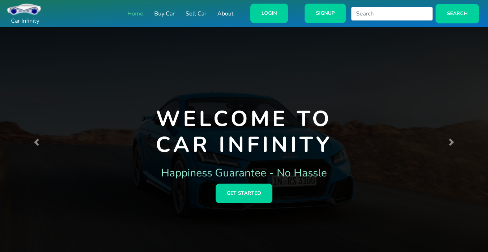
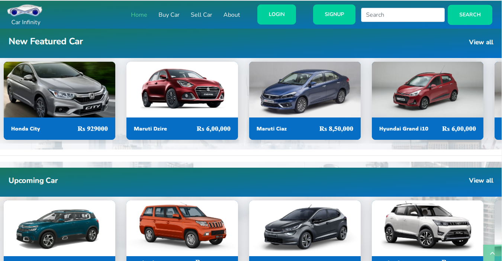
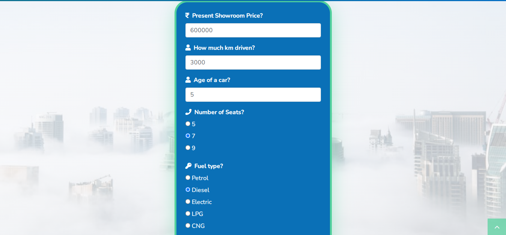
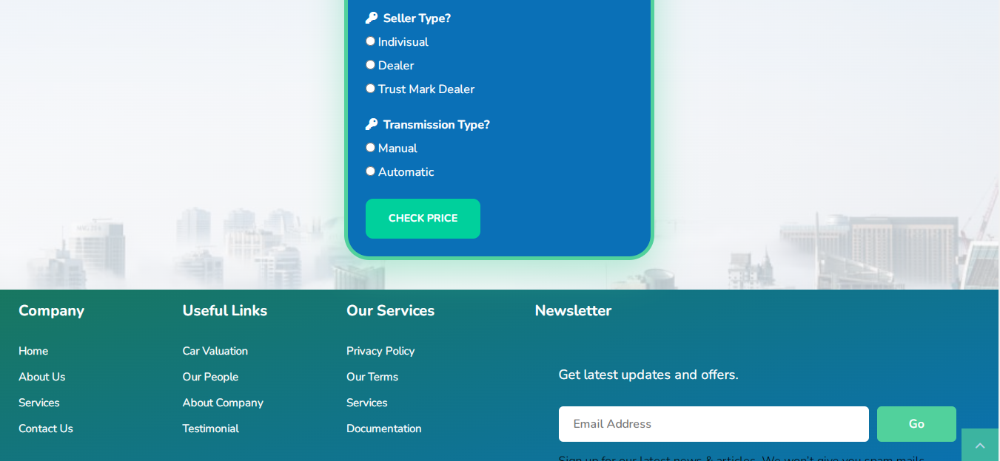
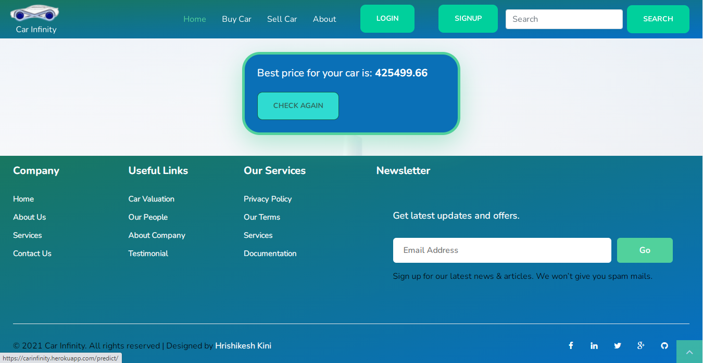

# Carinfinity_machine_learning_project
This is my final year project. This is second hand car buying and selling website. This project uses machine learning to predict the price of second hand cars. I have used XGBoost regressor to predict the data.

## Table of Content
  * [Demo](#demo)
  * [Problem Statement](#problem-statement)
  * [Approach](#approach)
  * [Technologies Used](#technologies-used)
  * [Installation](#installation)
  * [Deployement on Heroku](#deployement-on-heroku)
  * [Detailed Project Reports](#detailed-project-reports)
  * [Bugs & Logs](#bugs--logs)
  * [Contributors](#contributors)

## Demo
Link: [http://carinfinity.herokuapp.com](http://carinfinity.herokuapp.com)

Open the site, Go to About menu, In dropdown choose Car Valuation. 








## Problem Statement
As per reports Cars growth of new cars in the upcoming 5 years is an average of 3.5% while for used cars 5% and the ratio of used cars to new cars is increasing continuously. So the used cars market is increasing day by day and a consumer wants the best resale price of his car.

Currently, if anyone wants to sell their car either they have to take their car to a respective company workshop or have to make an appointment for the company to get an estimate of the price. This process involves a lot of time and resources. Our Objective is to make a model for third-party companies that will make an estimate of the Price of the customer’s car directly from their online portal. This will save customers time and help the company to reduce its cost and also streamline the process of selling used cars.

## Approach
Data Exploration : I started exploring dataset using pandas,numpy,matplotlib and seaborn.

Data visualization : Ploted graphs to get insights about dependend and independed variables.

Feature Engineering : Removed missing values and created new features as per insights.

Model Building & Testing : Tried many machine learning algorithms and checked the base accuracy to find the best fit.

Joblib File : Selected model as per best accuracy and created joblib file.

User Interface & deployment :  Created an UI with a form that takes all the necessary inputs from user and shows the output.
                          After that I have deployed project on heroku.
                          
## Technologies Used
 
   1. Python 
   2. Sklearn
   3. XGBoost
   4. Pandas, Numpy 
   5. Django
   6. Heroku
   7. HTML, CSS, JAVASCRIPT
   8. Bootstrap
  

## Dataset
[Download here](https://github.com/hrishikeshkini/Carinfinity_machine_learning_project/blob/main/cardekho.csv)

## Notebook
[Python notebook](https://github.com/hrishikeshkini/Carinfinity_ml_documentation)

## Installation
Click here to install [python](https://www.python.org/downloads/). To install the required packages and libraries, run this pip command in the project directory after cloning the repository:
```bash
git clone https://github.com/hrishikeshkini/Carinfinity_machine_learning_project.git
pip install -r requirements.txt
```
If pip is not already installed, Follow this [link](https://pip.pypa.io/en/stable/installation/)

## Deployement on Heroku
Create a virtual app on Heroku website. You can either connect your github profile or download cli to manually deploy this project.
Follow the instruction given on [Heroku Documentation](https://devcenter.heroku.com/articles/getting-started-with-python) to deploy a web app.

## Bugs & Logs

1. If you find a bug, kindly open an issue and it will be addressed as early as possible. [Open](https://github.com/hrishikeshkini/pima-indians-diabetes/issues)
2. Under localhost, logging is performed for all the actions and its stored onto logs.txt file
3. When the app is deployed on heroku, logs can be viewed on  heroku dashboard or CLI.

## Contributors
  [Hrishikesh Kini](https://github.com/hrishikeshkini)

